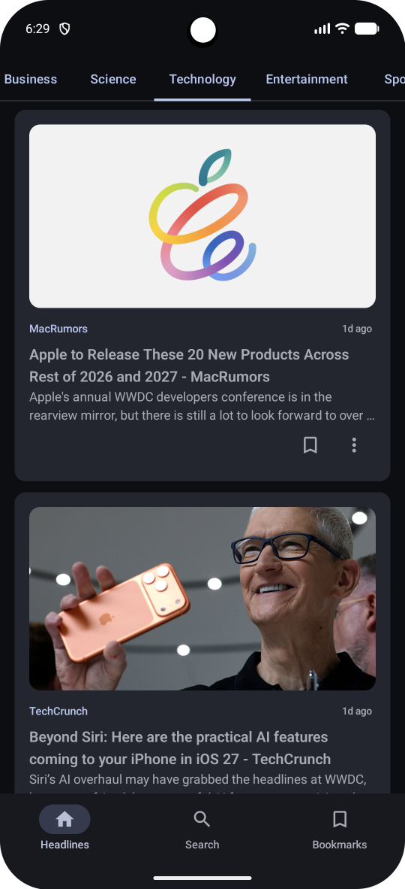
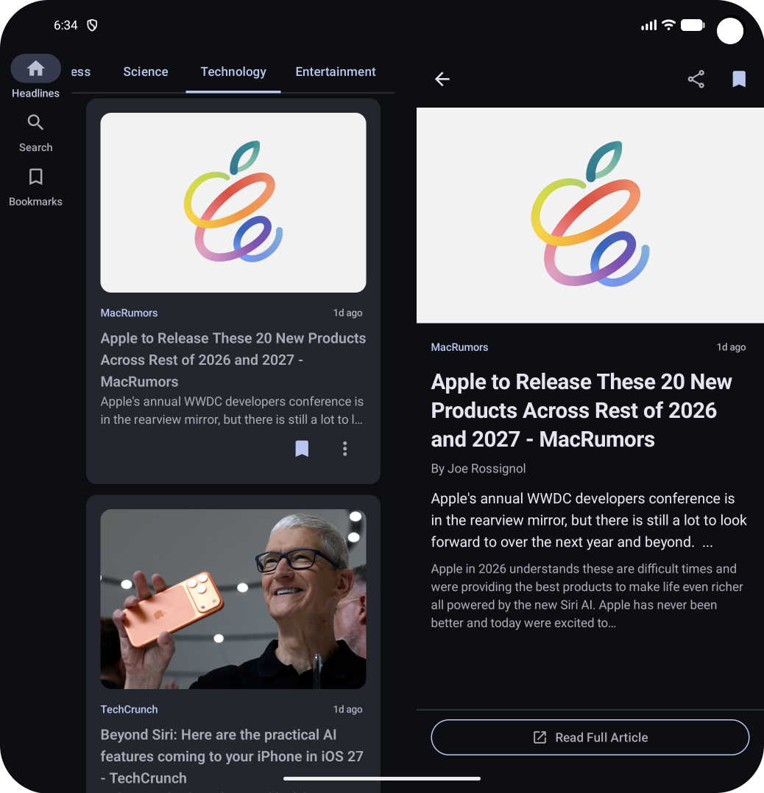
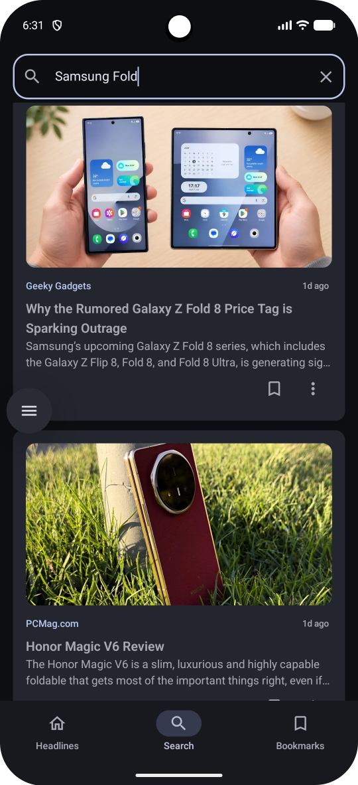
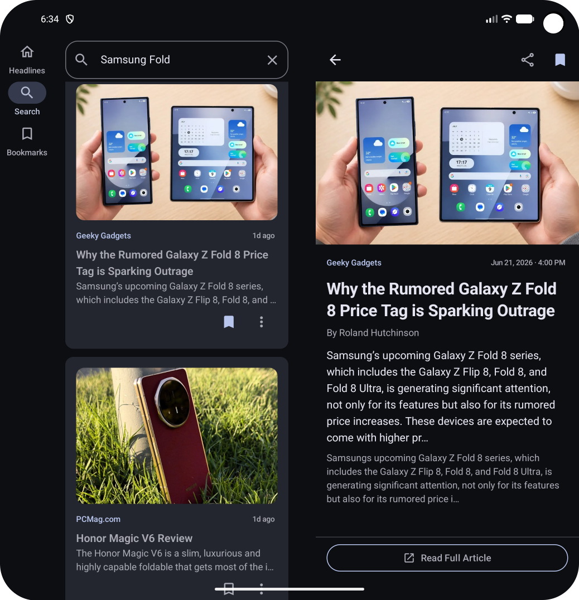
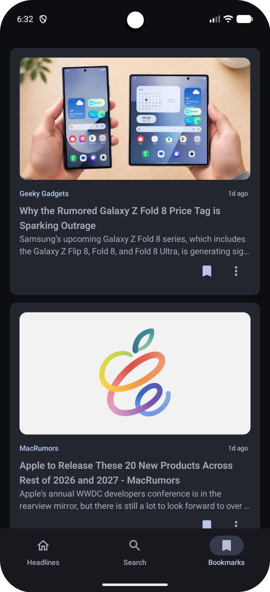
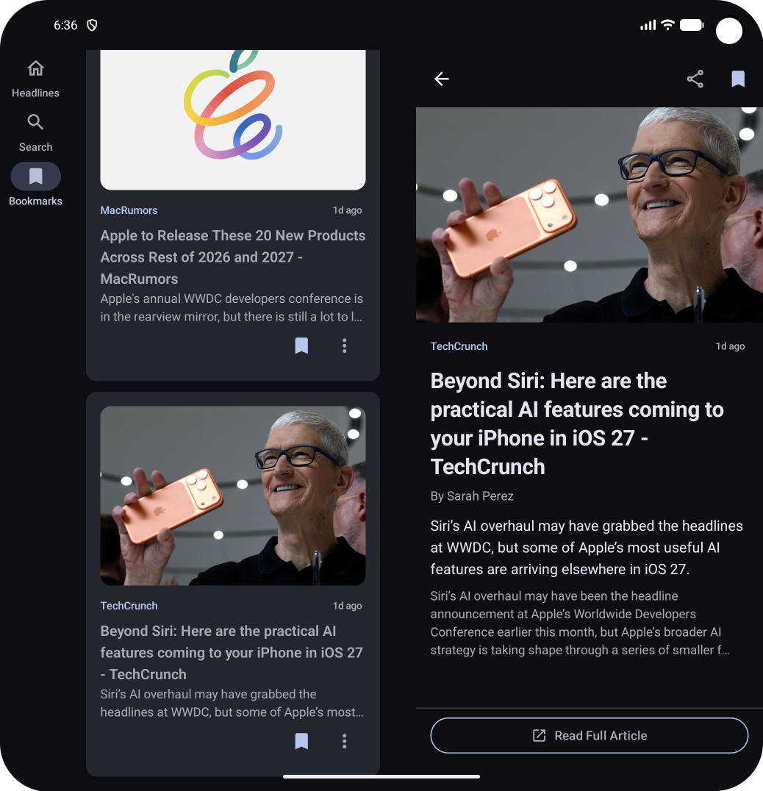
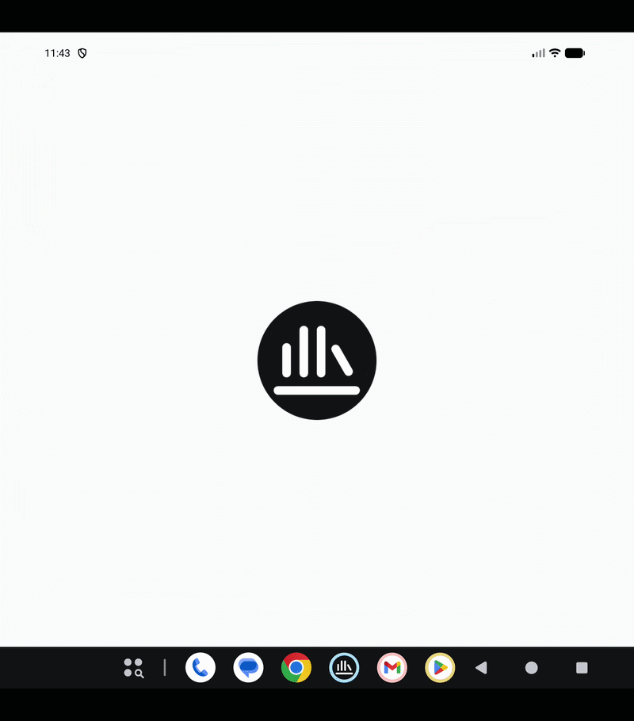
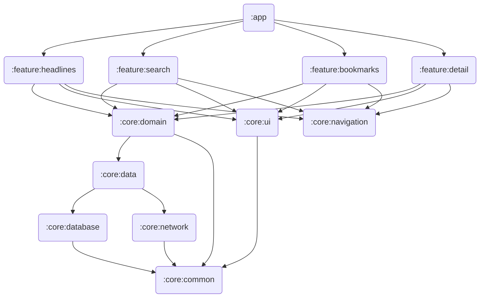

<div align="center">

# 📰 NewsWise

<p align="center">

</p>

[](https://github.com/UsmanAnsari/NewsWise/actions/workflows/newswise_ci.yml)
[](https://kotlinlang.org)
[](https://developer.android.com)
[](https://github.com/UsmanAnsari/NewsWise/actions)


## Multi-Module Android News App with Adaptive Layout

### A production-grade news application built with a multi-module architecture, offline-first data pipeline via `RemoteMediator`, and an adaptive UI that renders a split list-detail view on foldables and tablets - all verified by 83 tests spanning a complete testing pyramid from Room DAOs to Compose UI.

*The most architecturally ambitious portfolio project built to demonstrate multi-module architecture, adaptive layouts, and a full testing pyramid for mid-level to senior Android roles.*

</div>

---

## 📱 Features

### Core Functionality
- **🗞️ Live Headlines** - Category tabs (Top Stories, Business, Science, Technology, Health, Sports, Entertainment) with infinite scroll via Paging 3
- **⚡ Offline-First** - Articles cached to Room via `RemoteMediator` before display. Open the app with no network - content loads instantly from cache
- **🔍 Smart Search** - Debounced search (500ms) with Paging 3 across the full NewsAPI catalogue
- **🔖 Reactive Bookmarks** - Bookmarks persist across sessions and update in real-time via Room `Flow`
- **📖 Article Detail** - Full article view with share, open in browser, and bookmark actions
- **🔄 Pull-to-Refresh** - Refresh headlines with Material 3 `PullToRefreshBox`
- **🕐 Smart Timestamps** - Relative timestamps ("2h ago") that cross-fade to exact date/time on tap

### Technical Highlights
- **🧱 13-Module Architecture** - Compile-time enforced dependency boundaries with six Gradle convention plugins replacing ~500 lines of repeated boilerplate
- **📱 Adaptive Layout** - `NavigationSuiteScaffold` + `ListDetailPaneScaffold` for phone / foldable / tablet split-screen. The same composable tree adapts across all form factors
- **💾 RemoteMediator** - Category-keyed remote keys manage independent pagination per news category across 7 tabs
- **🔄 MVI Pattern** - `UiState / UiEvent / UiEffect` contracts on all four feature screens with strict unidirectional data flow
- **🧪 83 Tests** - Full pyramid: Room DAOs (Robolectric) → Use Cases → MockWebServer (network layer) → ViewModels → Compose UI
- **🚀 CI/CD** - Two-job pipeline where tests + lint gate the signed release APK. No APK from a broken commit

---

## 📸 Screenshots

<div align="center">

| Headlines | Headlines - Foldable Split |
|:---------------------:|:-----------------:|
|  |  |

| Search | Search - Foldable Split |
|:---------------------:|:-----------------:|
|  |  |

| Bookmarks | Bookmarks - Foldable Split |
|:---------------------:|:-----------------:|
|  |  |
</div>

---

## 🎬 [NewsWise DEMO - YouTube](https://youtu.be/44_Ot0A0ez0)
<div align="center">

|                NewsWise                |
|:--------------------------------------:|
|   |

</div>
## 📲 Download & Install

### Option 1: GitHub Actions Artifact (Recommended)
1. Go to [GitHub Actions](https://github.com/UsmanAnsari/NewsWise/actions)
2. Click the latest successful workflow run (green ✅)
3. Download `NewsWise-release-vXX` from the Artifacts section
4. Unzip and install `app-release.apk`

*Signed release build with R8/ProGuard enabled. May require "Install from Unknown Sources" in device settings.*

### Option 2: Build from Source
See [Getting Started](#-getting-started) below.

---

## 🛠️ Tech Stack

| Category | Technology | Why This Choice |
|----------|------------|-----------------|
| **Language** | Kotlin 2.2.21 | Coroutines, Flow, sealed classes throughout |
| **UI** | Jetpack Compose + Material 3 | Declarative UI with first-class adaptive layout APIs |
| **Adaptive Layout** | `NavigationSuiteScaffold`, `ListDetailPaneScaffold` | Auto phone / foldable / tablet layouts from one composable tree |
| **Architecture** | Clean Architecture + MVI, 13-Module | Compile-time enforced boundaries, independently testable layers |
| **Dependency Injection** | Hilt | Compile-time DI wired through convention plugins |
| **Networking** | Retrofit 3 + OkHttp 5 + Kotlinx Serialization | Type-safe HTTP with compile-time JSON parsing |
| **Database** | Room 2.8 | Reactive `Flow`, type-safe SQL, `RemoteMediator` integration |
| **Paging** | Paging 3 + `RemoteMediator` | Offline-first pagination with Room as the single source of truth |
| **Image Loading** | Coil 3 | Native Compose integration, automatic lifecycle handling |
| **Async** | Coroutines + Flow | `stateIn`, `flatMapLatest`, `debounce` - no RxJava overhead |
| **Testing** | JUnit 4, Robolectric, Turbine, MockWebServer, Compose UI Test | Complete pyramid with no emulator required |
| **CI/CD** | GitHub Actions | Two-job gated pipeline with signed release APK |
| **Build** | Gradle Version Catalog + Convention Plugins | Single-source dependency management across 13 modules |

---

## 🏗️ Architecture

NewsWise uses a **13-module Clean Architecture** with compile-time enforced dependency boundaries. Feature modules are isolated from each other by the build system - not by convention. `:feature:headlines` cannot import `:feature:search` even if a developer tries. Six Gradle convention plugins replace ~500 lines of repeated configuration across all 13 modules.

### Module Dependency Graph



### Three-Layer Architecture

```
┌──────────────────────────────────────────────────────────────┐
│                    PRESENTATION LAYER                        │
│  ┌──────────────┐  ┌──────────────┐  ┌───────────────────┐   │
│  │   Compose    │  │  ViewModels  │  │   MVI Contracts   │   │
│  │   Content    │◄─┤  (State Mgmt)├─►│ State/Event/Effect│   │
│  └──────────────┘  └──────────────┘  └───────────────────┘   │
├──────────────────────────────────────────────────────────────┤
│           DOMAIN LAYER  (:core:domain - pure Kotlin)         │
│  ┌──────────────┐  ┌──────────────┐  ┌──────────────────┐    │
│  │  Use Cases   │  │    Models    │  │   Repository     │    │
│  │  (10 total)  │  │  Article,    │  │   Interfaces     │    │
│  │              │  │  NewsCategory│  │                  │    │
│  └──────────────┘  └──────────────┘  └──────────────────┘    │
├──────────────────────────────────────────────────────────────┤
│                        DATA LAYER                            │
│  ┌──────────────┐  ┌──────────────┐  ┌──────────────────┐    │
│  │ Repositories │  │  NewsAPI     │  │   Room Database  │    │
│  │  + Remote    │◄─┤  (Retrofit)  ├─►│  ArticleEntity   │    │
│  │  Mediator    │  │              │  │  RemoteKeyEntity │    │
│  └──────────────┘  └──────────────┘  └──────────────────┘    │
└──────────────────────────────────────────────────────────────┘
```

### MVI - Unidirectional Data Flow

```
┌──────────────────────────────────────────────────────────────┐
│                         MVI PATTERN                          │
│                                                              │
│               ┌──────────────────────┐                       │
│   ┌──────────►│   CONTENT COMPOSABLE │───────────┐           │
│   │           │  (internal, stateless│           │           │
│   │           └──────────────────────┘           │           │
│   │                                              │           │
│  STATE                                         EVENT         │
│ (immutable                                (sealed class)     │
│  data class)                                     │           │
│   │           ┌──────────────────────┐           │           │
│   └───────────│      VIEWMODEL       │◄──────────┘           │
│               │     onEvent()        │                       │
│     EFFECT    └──────────┬───────────┘                       │
│  (Navigation,            │                                   │
│  Share, Browser)  ┌──────▼──────────┐                        │
│                   │   USE CASES     │                        │
│                   └──────┬──────────┘                        │
│                          │                                   │
│                   ┌──────▼──────────┐                        │
│                   │  REPOSITORY     │                        │
│                   │ (Room + API)    │                        │
│                   └─────────────────┘                        │
└──────────────────────────────────────────────────────────────┘
```

### Convention Plugins (build-logic)

Six reusable Gradle plugins eliminate ~500 lines of repeated configuration across 13 modules. Each module's `build.gradle.kts` is reduced to 5–10 lines:

| Plugin | Applied To | Provides |
|--------|-----------|----------|
| `newswise.android.library` | All Android modules | `compileSdk`, `minSdk`, JVM toolchain |
| `newswise.android.feature` | Feature modules | Core deps + Hilt + Lifecycle + Robolectric + Compose test |
| `newswise.android.compose` | Compose modules | Compose BOM, Material 3, UI tooling |
| `newswise.android.hilt` | DI modules | Hilt plugin + annotation processor |
| `newswise.android.room` | Database module | Room runtime + KSP processor |
| `newswise.jvm.library` | Pure Kotlin modules | JVM toolchain only - no Android SDK |

---

## 🗄️ Data Architecture

### Offline-First with RemoteMediator

```
User opens Headlines tab (category = "technology")
         │
         ▼
  PagingSource reads Room
  (instant display - no network wait)
         │
         ▼
  RemoteMediator triggered in background
  ┌─────────────────────────────────────┐
  │ 1. Check RemoteKeyEntity(category)  │ ← per-category pagination key
  │ 2. Fetch page from NewsAPI          │
  │ 3. Upsert articles to Room          │ ← isBookmarked preserved
  │ 4. Save next page key               │
  └─────────────────────────────────────┘
         │
         ▼
  Room emits updated PagingData
  UI recomposes automatically
```

### Search Upsert Pattern

`SearchPagingSource` fetches directly from the API without writing to Room. Before any action on a search result, the article must be written to Room first - otherwise `toggleBookmark` returns null and silently fails.

```kotlin
private fun onBookmarkClick(article: Article) {
    viewModelScope.launch {
        upsertArticle(article)      // write to Room first
        toggleBookmark(article.url) // now Room can find it
    }
}
```

### `stateIn` vs `MutableStateFlow` - Intentional Pattern

The choice is consistent across all four features:

| Screen | State Holder | Reason |
|--------|-------------|--------|
| Headlines | `MutableStateFlow` | Category selection directly mutates `selectedCategory` |
| Search | `MutableStateFlow` | Query changes + paging flow both mutate state |
| Bookmarks | `stateIn` | `UiState` is entirely derived from `getBookmarks()` Flow |
| Detail | `stateIn` | `UiState` is entirely derived from `observeArticle(url)` Flow |

---

## 🧪 Testing

83 tests across 7 modules. All run with `./gradlew test` - no emulator required.

```
Unit tests          43   ViewModels (28) + Use Cases (15)
Integration tests   40   Compose UI (29) + Room DAOs (6) + MockWebServer (5)
E2E tests            0   deliberate — NewsAPI responses change hourly
─────────────────────────
Total               83   across 16 test classes in 7 modules
```

| Module | Test Class | Tests | Type |
|--------|-----------|-------|------|
| `:core:database` | `ArticleDaoTest` | 4 | Integration - in-memory Room + Robolectric |
| `:core:database` | `RemoteKeyDaoTest` | 2 | Integration - in-memory Room + Robolectric |
| `:core:domain` | `GetArticleByUrlUseCaseTest` | 4 | Unit |
| `:core:domain` | `UpsertArticleUseCaseTest` | 4 | Unit |
| `:core:domain` | `ToggleBookmarkUseCaseTest` | 3 | Unit |
| `:core:domain` | `GetBookmarksUseCaseTest` | 2 | Unit |
| `:core:domain` | `GetBookmarkStatusUseCaseTest` | 2 | Unit |
| `:core:network` | `NewsApiServiceTest` | 5 | Integration - MockWebServer |
| `:feature:headlines` | `HeadlinesViewModelTest` | 7 | Unit |
| `:feature:headlines` | `HeadlinesContentTest` | 6 | Integration - Compose UI + Robolectric |
| `:feature:search` | `SearchViewModelTest` | 10 | Unit |
| `:feature:search` | `SearchContentTest` | 4 | Integration - Compose UI + Robolectric |
| `:feature:bookmarks` | `BookmarkViewModelTest` | 5 | Unit |
| `:feature:bookmarks` | `BookmarkContentTest` | 6 | Integration - Compose UI + Robolectric |
| `:feature:detail` | `DetailViewModelTest` | 6 | Unit |
| `:feature:detail` | `DetailContentTest` | 13 | Integration - Compose UI + Robolectric |

---

## 🚀 CI/CD Pipeline

Two-job pipeline. The build job only fires when tests and lint both pass - no signed APK can be produced from a broken commit.

```
Push / PR
    │
    ▼
┌────────────────────────────────────────┐
│  Job 1: Tests & Lint      (~4 min)     │
│  ├── ./gradlew test --continue         │  All 83 tests across all modules
│  ├── ./gradlew lintDebug               │
│  ├── Upload test reports               │  if: always() - available even on failure
│  └── Upload lint reports               │
└─────────────────────┬──────────────────┘
                      │ needs (only on success)
                      ▼
┌────────────────────────────────────────┐
│  Job 2: Build Release APK              │
│  ├── Decode keystore from GitHub secret│
│  ├── ./gradlew assembleRelease         │
│  └── Upload signed APK artifact        │  90-day (main) / 30-day (branches)
└────────────────────────────────────────┘
```

---

## 🎓 What I Learned

<details>
<summary><b>Multi-Module Architecture</b></summary>
<br>

**Convention plugins are the correct solution to Gradle duplication.** My first instinct was to copy-paste `build.gradle.kts` across modules. Each module ended up with 80 lines of identical configuration, and updating a dependency meant touching 13 files. Convention plugins reduced each module's build file to 5–10 lines and centralised every configuration decision in one place.

**`internal` visibility enforces module contracts.** All content composables (`HeadlinesContent`, `BookmarkContent`, etc.) are `internal`. They cannot be called from `:app` or other feature modules - only from within their own module. The architecture is enforced by the compiler, not by convention.

**`:core:domain` has zero Android imports by design.** The domain layer contains all business logic but imports nothing from `android.*` or `androidx.*`. This was enforced by using `newswise.jvm.library` instead of `newswise.android.library`. Any accidental Android import becomes a compile error rather than a code review comment.

</details>

<details>
<summary><b>Adaptive Layout</b></summary>
<br>

**`ListDetailPaneScaffold` handles all the hard parts.** Getting a split-screen that adapts to window size, handles the back stack correctly per form factor, and animates pane transitions cleanly would have been hundreds of lines of manual layout logic. `ListDetailPaneScaffold` does it in ~30 lines.

**`key(articleUrl)` is essential for correctness.** Without `key()`, switching from Article A to Article B on tablet reuses the same `NavHost` and `DetailViewModel`. `NavHost` ignores `startDestination` changes after first composition - Article B would show Article A's content. `key(articleUrl)` forces complete subtree recreation when the URL changes.

**`NavigationSuiteScaffold` does not pre-apply status bar insets.** The Scaffold handles the navigation component area but not the status bar. Each pane must apply `statusBarsPadding()` independently. Missing it on one pane causes content to render under the status bar on that form factor only - easy to miss during phone-only testing.

**Skipping `NavigationSuiteScaffold` entirely fixes the detail screen gap.** When reading an article on phone, the empty `NavigationBar` still reserves 80dp below the content even with `Color.Transparent`. The fix: when `!showNavigationItems`, skip the scaffold entirely and wrap content in a `Box(navigationBarsPadding())`. The Scaffold overhead only appears when tabs are visible.

</details>

<details>
<summary><b>RemoteMediator & Offline-First</b></summary>
<br>

**Category-keyed remote keys enable independent pagination.** A single `nextPage` value won't work when the user can switch between 7 categories. Each category needs its own `prevPage`/`nextPage` stored in `RemoteKeyEntity(category, prevPage, nextPage)`. Switch from Business to Sports - Paging 3 picks up exactly where it left off in Sports.

**`isBookmarked` must survive upsert.** When `RemoteMediator` fetches a fresh page and upserts articles into Room, it must not overwrite `isBookmarked = true` with `false`. The solution: read the existing value before writing, then preserve it in the upsert. Missing this causes bookmarks to silently disappear on the next data refresh.

**`upsertArticle` must precede any search action.** `SearchPagingSource` fetches directly from the API and never writes to Room. If the user bookmarks or taps a search result, the article must be upserted first - otherwise `toggleBookmark` and `observeArticle` return null and fail silently with no error or crash.

</details>

<details>
<summary><b>Testing Strategy</b></summary>
<br>

**Test content composables, not Screens.** Screens depend on `hiltViewModel()` which requires Hilt test infrastructure. Content composables accept state as plain parameters. `BookmarkContent(uiState = BookmarkUiState(articles = emptyList()), onEvent = {})` is testable in four lines with no mocking.

**MockWebServer is the only place that covers the network layer.** ViewModel tests use fakes. DAO tests use in-memory Room. Neither touches HTTP. `NewsApiServiceTest` with `MockWebServer` is the only test that verifies Kotlinx Serialization correctly parses the actual NewsAPI JSON structure - including nullable fields that can fail silently at runtime with no crash.

**Robolectric replaces emulators for DAO tests.** DAO tests used to require an emulator via `androidTest`. Moving to Robolectric with in-memory Room means they run in under 2 seconds on the JVM and in CI without spinning up an AVD. The `asSnapshot()` extension from `paging-testing` makes `PagingSource` queries assertable as a plain list.

**`stateIn` initialValue timing requires a test helper.** `DetailViewModel.uiState` starts as `DetailUiState(isLoading = true)`. Under `UnconfinedTestDispatcher`, the first real emission may arrive before or after the initial value. `awaitNonLoading()` - a helper that consumes items while `isLoading = true` - makes assertions deterministic regardless of dispatcher timing.

**The BOM must be applied to `testImplementation` explicitly.** `ui-test-junit4` has no version in `libs.versions.toml` - it is BOM-managed. The BOM applied to `implementation` does NOT extend to `testImplementation` in Gradle. Missing `add("testImplementation", bom)` in the convention plugin produces a "could not resolve" error that looks like a dependency availability problem but is purely a missing BOM declaration.

</details>

<details>
<summary><b>CI/CD & ProGuard</b></summary>
<br>

**Two CI jobs gate the artifact on passing tests.** A single job with `--continue` still produces an APK even if tests fail - `assembleRelease` runs regardless. Splitting into `test-and-lint` + `build` with `needs: [test-and-lint]` means the signed APK artifact can only appear in a run where all 83 tests are green.

**`-keep class androidx.compose.** { *; }` defeats R8.** This line (inherited from an earlier project) prevents R8 from shrinking or obfuscating any Compose code. Compose AARs ship their own consumer ProGuard rules - no custom rule is needed. Removing it lets R8 properly shrink Compose internals.

**Type-safe Navigation routes must be kept explicitly.** Navigation 2.8+ serializes route objects into the back stack using Kotlinx Serialization. Without `-keep @kotlinx.serialization.Serializable class com.uansari.newswise.core.navigation.** { *; }`, R8 renames the route classes and `savedStateHandle.get<String>(ARG_URL)` returns null at runtime - with no crash, just a blank screen.

</details>

---

## 🚧 Portfolio vs Production

### What's Implemented

| Feature | Status | Notes |
|---------|--------|-------|
| **Offline-first headlines** | ✅ Complete | `RemoteMediator` + Room cache |
| **Category pagination** | ✅ Complete | Per-category remote keys across 7 tabs |
| **Search** | ✅ Complete | Debounced, paging, bookmark overlay |
| **Bookmarks** | ✅ Fully Offline | Reactive Room `Flow` |
| **Article Detail** | ✅ Complete | Share, browser launch, bookmark |
| **Adaptive Layout** | ✅ Complete | Phone / foldable / tablet |
| **Pull-to-Refresh** | ✅ Complete | Material 3 `PullToRefreshBox` |
| **Smart Timestamps** | ✅ Complete | Relative → exact on tap with cross-fade |
| **Testing** | ✅ 83 tests | Full pyramid, no emulator |
| **CI/CD** | ✅ Automated | Two-job gated pipeline, signed APK |
| **ProGuard / R8** | ✅ Configured | Custom rules for Room, Navigation, Serialization |

### Production Enhancements (Deliberate Scope Decisions)

| Enhancement | Why Not Included |
|------------|-----------------|
| **Push notifications** | Requires Firebase Messaging - outside the architectural scope |
| **Baseline Profile** | Low effort but doesn't demonstrate the target skills |
| **Deep links** | Medium effort, incremental value |
| **Multi-language** | NewsAPI supports 54 countries - feasible but not the focus |
| **Accessibility (TalkBack)** | Partial support via Material 3 semantics; custom semantics not implemented |

*This project is optimised for demonstrating multi-module architecture, adaptive layouts, and a complete testing pyramid - the technical skills most evaluated for senior Android roles. Production features are documented here to show awareness, not as gaps.*

---

## 🗺️ Roadmap

- [x] **Phase 0** - 13-module scaffold, six convention plugins, CI/CD skeleton, Version Catalog
- [x] **Phase 1** - `:core:database` (Room + RemoteKey), `:core:network` (Retrofit + DTOs), `:core:data` (repositories + `RemoteMediator`), `:core:testing` (fakes + factories)
- [x] **Phase 2** - `:feature:headlines` - `RemoteMediator`, category tabs, offline-first Paging 3
- [x] **Phase 3** - `:feature:search` - debounced search, API-only paging, `flatMapLatest`
- [x] **Phase 4** - `:feature:bookmarks` - reactive Room-driven list, `stateIn`
- [x] **Phase 5** - `:feature:detail` - type-safe navigation, `observeArticle`, search upsert fix
- [x] **Phase 6** - Adaptive navigation - `NavigationSuiteScaffold`, `ListDetailPaneScaffold` split view
- [x] **Phase 7** - Compose UI tests - Robolectric, `createComposeRule`, 26 composable UI tests
- [x] **Phase 8** - CI/CD expansion - two-job gated pipeline, signed release APK, MockWebServer tests, DAO tests, full 83-test suite

---

## 🚀 Getting Started

### Prerequisites
- Android Studio Meerkat or later
- JDK 21
- NewsAPI key - free at [newsapi.org](https://newsapi.org)

### Setup

```bash
# 1. Clone the repository
git clone https://github.com/UsmanAnsari/NewsWise.git
cd NewsWise

# 2. Add your NewsAPI key to local.properties (create if it doesn't exist)
echo "NEWS_API_KEY=your_key_here" >> local.properties

# 3. Build and run
./gradlew assembleDebug
```

Open in Android Studio and run on any device or emulator. To see the adaptive split-screen layout, use a foldable emulator or the **Resizable (Experimental)** option in Android Studio's Device Manager and expand the window to medium or expanded width.

### Run Tests

```bash
./gradlew test                      # all 83 tests - no emulator needed
./gradlew :feature:detail:test      # single feature module
./gradlew :core:database:test       # DAO tests (Robolectric)
./gradlew :core:network:test        # MockWebServer network tests
./gradlew test --continue           # collect all failures across modules
```

---

## 👤 Author

**Usman Ali Ansari**

- 💼 LinkedIn: [usman1ansari](https://www.linkedin.com/in/usman1ansari)
  
---

## 🙏 Acknowledgments

- [NewsAPI](https://newsapi.org) - Free tier news API used for all article data
- [Material Design 3](https://m3.material.io) - Design system and adaptive layout components
- [Now in Android](https://github.com/android/nowinandroid) - Reference for multi-module architecture patterns

---

<div align="center">

### ⭐ If this project helped you, consider giving it a star! ⭐

**Built with ❤️ as the flagship project in a deliberate Android architecture progression**

*[QuickHabit](https://github.com/UsmanAnsari/QuickHabit) → [ExpenseFlow](https://github.com/UsmanAnsari/ExpenseFlow) → [StockWise](https://github.com/UsmanAnsari/StockWise) → [MovieWise](https://github.com/UsmanAnsari/MovieWise) → **NewsWise***

</div>
